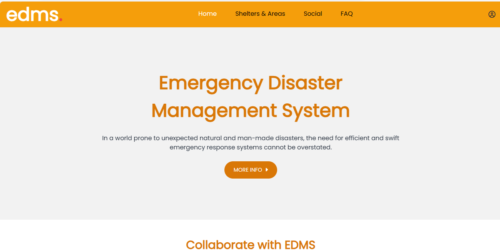
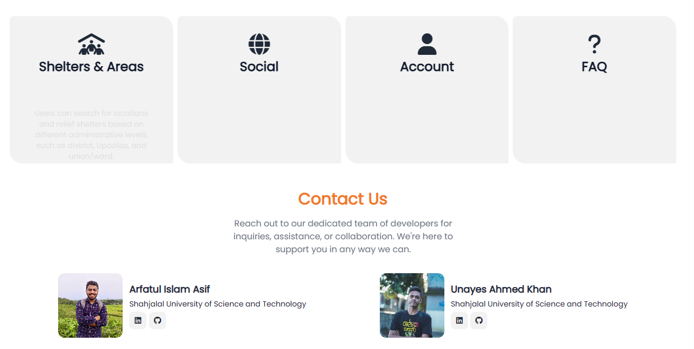
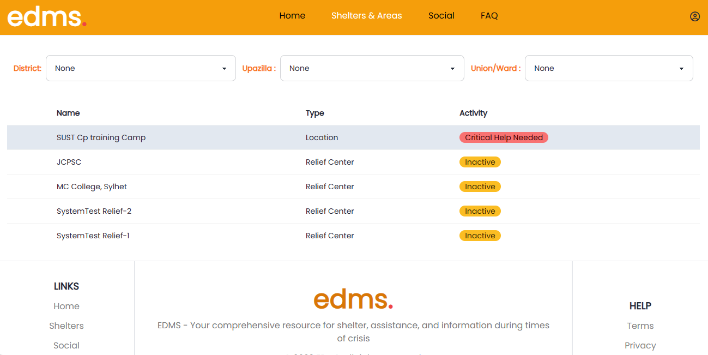
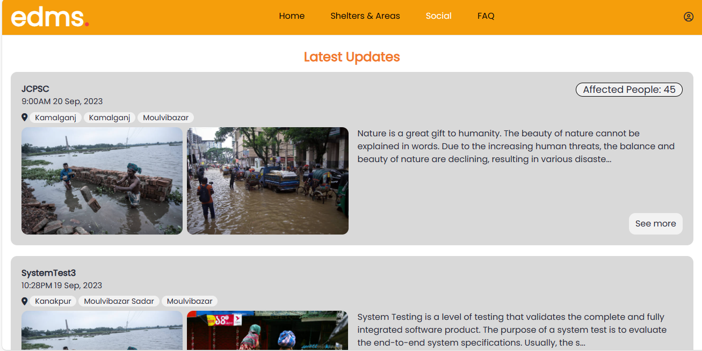
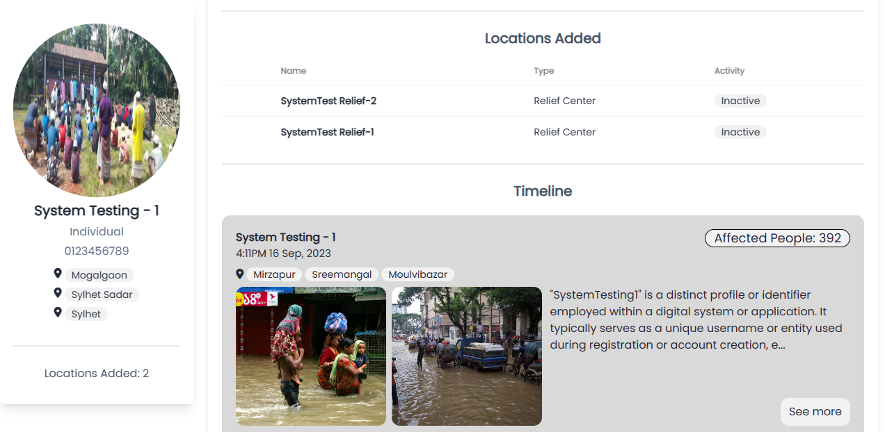
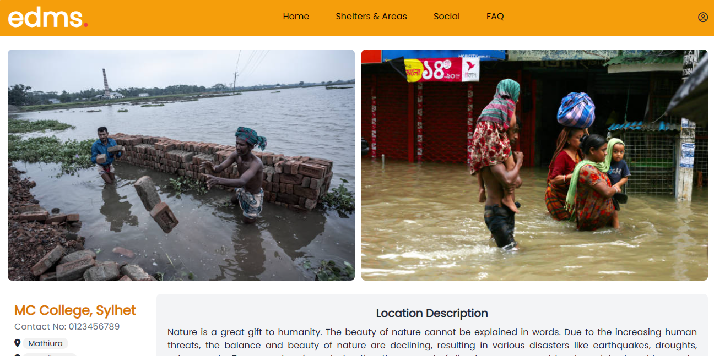
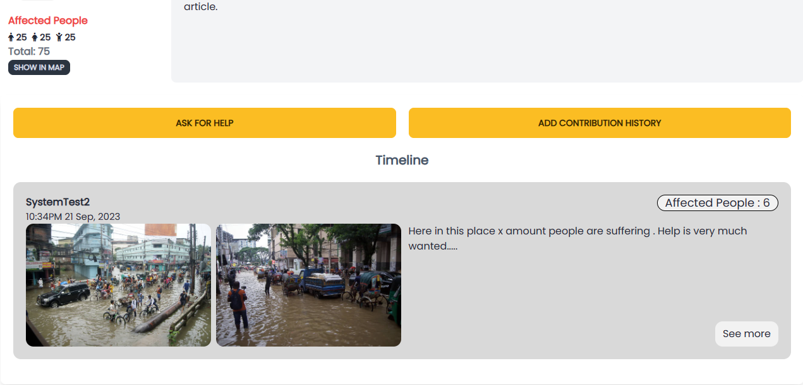
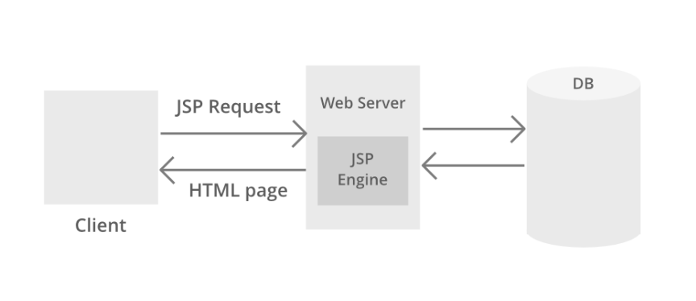
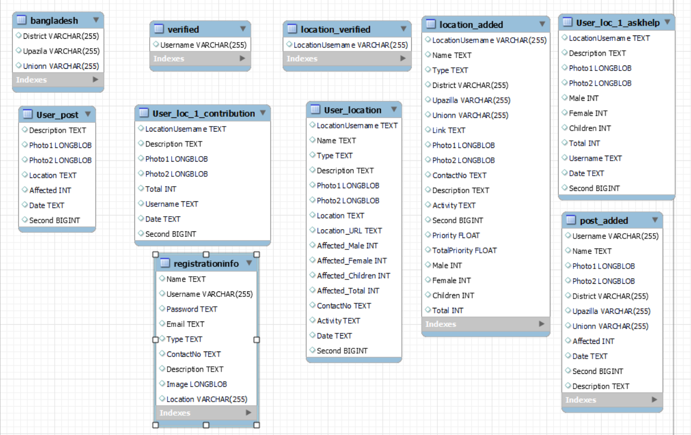

# Emergency Disaster Management System (EDMS)

### <a href="http://144.24.180.251:8080/EDMS/" target="_blank">Visit Website</a>

### <a href="https://youtu.be/D0A-8E1dcPM" target="_blank">Youtube Demonstration Video</a>

## Achievements :

Our Project has been selected as one of the top 10 finalist for the therap java fest 2023 in Bangladesh. 

## Introduction

Before we delve into the details of our project, it's essential to understand the story that inspired us to create the Emergency Disaster Management System (EDMS). In 2022, Sylhet experienced a devastating and prolonged flood that resulted in significant losses. During this challenging period, our team, along with some dedicated friends, organized a volunteer group. We collected funds, identified relief centers in the city, and regularly provided essential supplies such as food and water. We also extended our aid to rural areas.

However, we encountered several challenges. One of the most significant issues was the lack of accurate information about where relief was needed most. Some areas received multiple rounds of assistance due to their proximity to roads, while more remote locations were often neglected. We had to rely on word-of-mouth information or local contacts to make critical decisions.

We realized that having precise and real-time information was crucial during disaster situations. While social media platforms like Facebook helped to some extent, there was no dedicated system to provide comprehensive information about relief shelters, aid distribution, and the needs of affected areas.

This experience led us to the idea of creating a robust Emergency Disaster Management System (EDMS).

## EDMS Description

EDMS serves as an information hub for individuals, volunteer groups, and social welfare agencies during times of emergency. Users can add relief shelters or locations in need of assistance, request help, and provide essential details such as the number of affected individuals. Volunteer groups can search for relief shelters or areas based on specific criteria, and individuals can actively participate by contributing real-time updates about their local areas. EDMS also functions as a social platform where users can share their experiences related to disaster relief efforts.

## Table of Contents

- [Introduction](#introduction)
- [EDMS Description](#edms-description)
- [Technologies and Libraries](#technologies-and-libraries)
- [Table of Contents](#table-of-contents)
- [Home Page](#home-page)
- [Shelter and Areas](#shelter-and-areas)
- [Register Page](#register-page)
- [Login Page](#login-page)
- [Profile Page](#profile-page)
- [Add Post](#add-post)
- [Add Location](#add-location)
- [Update Profile](#update-profile)
- [Location Profile](#location-profile)
- [Ask For Help](#ask-for-help)
- [Add Contribution](#add-contribution)
- [Social Page](#social-page)

## Home Page

 

This is the home page of EDMS. Here you can find a navbar. From there one can go 
to shelter and areas, social, FAQ, or  profile page   
Here we have a brief description of EDMS . ...

Also, there is a brief description of all the other pages.

At the end, you can find contact information about us. As this is a pilot project 
one can contact us about any kind of queries they have.

At the end, we have the footer section of EDMS. 

## Shelter and Areas 

The page is the core of the emergency disaster management system. Here you can see a 
search bar. Right here you can see name-type activities of relief shelters and locations.

If nothing is selected in the search bar, you will see locations and relief shelters for all places.
 If you choose a specific district, you will then see locations within that particular 
district. If you select a specific upazila (sub-district) within that district,
 the system will display relief shelters or locations specific to that upazila. 
Finally, if you select a particular union or ward within that upazila, you will see
 relief shelters located in that union or ward. This hierarchical filtering system 
allows users to narrow down their search and find relevant information based on their
chosen location criteria.

All locations and relief shelters are ranked by a priority value and categorized
 as active, inactive, or in critical need of help. The "active" status is assigned 
if there has been a recent request for assistance within the past 3 days, while
 locations without recent requests are automatically marked as "inactive." 

Utilizing a decision tree Machine Learning model, we determine which relief shelters
are in "critical help needed" status, granting them the highest priority. 
We trained the model with some information that we gathered while working on the flood 
relief efforts.Besides taking into account how many times the request was asked
this model also uses the river water's danger level and forecasted level for 7 days 
for a particular location to make the proper prediction.
As EDMS shall evolve, 
we plan to incorporate more data sources to further enhance the model's precision 
in identifying areas where critical help is most urgently needed.

Now, if you select a relief shelter, you will be redirected to the shelter's profile page. 
However, to access the profile page, users will be required to log in.

## Social Page

Our social page is customized for each user. 
We employ algorithms to determine places that are geographically near to each user,
taking into account their location data. 
Subsequently, we sort the posts on the page based on their proximity to the user's 
location and the recency of each post. 

If you click on any name on a post you will be redirected to the profile page.
If it is an individual/volunteer group then you shall be redirected there. If it
is a location/shelter name then you will be redirected to the location's profile page

While our social page resembles a conventional social media news feed, 
its primary purpose is to serve as a platform for news updates related to 
disaster management efforts.

## Register Page

Users can create accounts to access the full features of EDMS.

## Login Page

Registered users can log in to access their profiles and utilize the system's features.

## Profile Page

Individuals, government officials, and volunteer groups have their profiles where they can add posts, locations, and update their information.

All the posts and locations you add will be displayed in your profile
under the sections "Locations Added" and "Timeline." 

## Add Post

Registered users can share information or requests on the platform.

## Add Location

Users can add details about locations that require assistance.

## Update Profile

Profile owners can update their contact information and password as needed.

## Location Profile

 

Each added location has its profile, where users can ask for help and add contribution information.

## Ask For Help

Anyone can ask for help in any particular location.

## Add Contribution

Anyone can add their contribution info in any particular location.

## Project Architecture

## Database 

## Conclusion

EDMS operates as an information-sharing platform, facilitating informed decision-making for individuals and volunteer groups. Users cannot delete posts or locations they've shared to maintain transparency and system integrity.

## Technologies and Libraries

Our project relies on the following technologies, libraries, and tools:
- **Backend:** Java
- **Build Tools:** Maven
- **Web Server:** Apache Tomcat
- **Database:** MySQL
- **Version Control:** GitHub
- **Integrated Development Environment (IDE):** Eclipse IDE
- **Frontend Technologies:** HTML, CSS, JavaScript
- **Java Web Technologies:** Servlets and JSP
- **Java Database Connectivity (JDBC)**
- **Data Parsing:** Jsoup Library
- **Password Hashing:** JBCrypt

## Authors

- [Arfatul Islam Asif](https://github.com/ArfatulAsif)
- [Unayes Ahmed Khan](https://github.com/Unayes09)
  
---

**Note**: EDMS is a non-monetized platform focused solely on disaster management and relief coordination.

